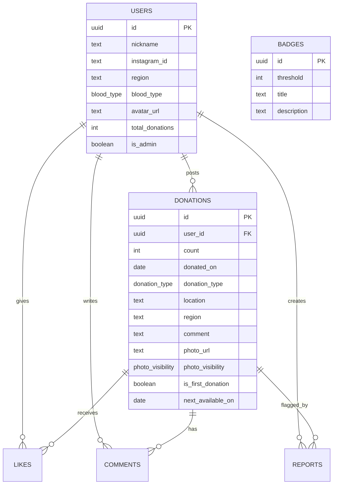

# Blood Heroes Architecture

## Service Concept

Blood Heroes is a social community that praises blood donors. The product principle is not competition, but appreciation. Counts, badges, feeds, and share cards exist to make donors feel proud, thanked, and willing to invite someone else.

## Directory Structure

```txt
app/
  (auth)/login/              Login page
  admin/                     Moderation dashboard
  api/donations/             Donation list/create API
  api/profile/               Profile API
  api/reports/               Report API
  donations/new/             Donation post MVP
  feed/                      Instagram-like feed
  legal/                     Terms, privacy, guidelines, portrait consent
components/                  Reusable UI and domain components
lib/                         Supabase clients, donation logic, badges, mock data
supabase/schema.sql          Tables, seed badges, RLS policies
types/database.ts            Shared TypeScript domain types
```

## MVP Scope

- TOP page with hero, stats, recent posts, Instagram-style share preview
- Login screen prepared for Supabase Auth
- Donation post form
- Donation feed
- Canvas-based Instagram story card generation
- Badge system
- Next donation availability calculation
- Admin dashboard scaffold
- Legal and safety pages

## Future Scope

- Regional ranking framed as gratitude, not rivalry
- Events
- Donation room map
- Company and school groups
- Reservation links
- Notifications
- Streaks
- Donor interviews

## Database Design

| Table | Purpose |
| --- | --- |
| users | Public profile and admin flag |
| donations | Donation records and generated-card source data |
| badges | Badge thresholds and labels |
| likes | Thank-you reactions |
| comments | Supportive comments |
| reports | Safety and moderation reports |

## ER Diagram



## Screen Design

| Screen | Main UX |
| --- | --- |
| TOP | Show mission, aggregate stats, recent praise posts, Instagram share previews |
| Login | Google and email-login entry points |
| Donation Post | Record count/date/place/comment/photo visibility and immediately preview share card |
| Feed | Instagram-style vertical feed with badges and next available date |
| Admin | Review posts, users, reports, and inappropriate images |
| Legal | Terms, privacy, portrait consent, posting guidelines |

## Component Split

| Component | Responsibility |
| --- | --- |
| AppShell | Header and mobile bottom navigation |
| Button / LinkButton | Consistent actions |
| StatCard | TOP stats |
| BadgePill | Badge label by donation count |
| PostCard | Feed item |
| DonationForm | MVP post workflow |
| DonationStoryCard | Instagram story image generation and download |
| InstagramGrid | TOP share-preview grid |
| LegalPage | Reusable legal page layout |

## API Design

| Method | Path | Purpose |
| --- | --- | --- |
| GET | /api/donations | Latest public donation posts |
| POST | /api/donations | Create logged-in user's donation |
| GET | /api/profile | Get current user's profile |
| PUT | /api/profile | Upsert current user's profile |
| POST | /api/reports | Report a donation |

## Supabase Auth

- Enable Google provider in Supabase Auth.
- Enable email magic link or OTP.
- Set Site URL to the Vercel production URL.
- Add local redirect URL: `http://localhost:3000/**`.

## RLS Notes

- Public can read visible donation posts and public profiles.
- Users can create/update their own profile and donation records.
- Users can like, comment, and report as themselves.
- Admin operations depend on `users.is_admin = true`.
- Moderation uses soft-delete fields to avoid accidental data loss.
- Donation photos are stored in the `donation-photos` bucket with per-user folder policies. See `supabase/storage.sql`.

## Safety Notes

- The UI and copy explicitly say this is not an official Red Cross service.
- Photo visibility is selected per post.
- Legal pages include terms, privacy, portrait consent, and posting guidelines.
- Future image moderation should run before public display.
